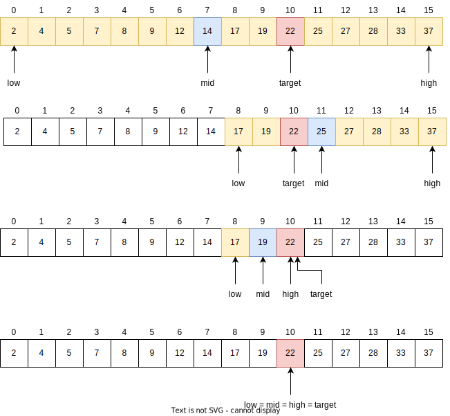

# Binary search

It is an algorithm to locate a target value within a sorted sequence of *n* elements.

Consider a sorted and indexable list.
For any index *j*, any values from 0 to *j*-1 are smaller than *j*, and any values from *j*+1 to *n*-1 are greater than *j*.
An element of the list is called a candidate if, at the current stage of the search, it is not possible to determine if this value matches the target.
The algorithm maintains two parameters: low and high.
The candidate entries have index at least low and at most high.
In the beginning low = 0 and high = *n*-1.
The target value is compared to the median candidate, that is, the item with index *mid* = (low+high)/2.
Therefore, the following cases are considered:

- if the target equals the item with index *mid*, that is, target = data[mid], then we have found the target and the search ends.

- if target < data[mid] then we look in the first half of the list, that is, on the interval from low to mid-1.

- if target > data[mid] then we look in the second half of the list, that is, on the interval from mid+1 to high.

If low > high results in an unsuccessful search, since the interval [low,high] is empty.

An unsuccessful result is also obtained if the list does not contain the target.

Example of a binary search for target value 22.

## Complexity

This search runs in *O(log n)* time.
