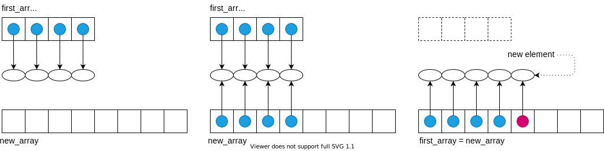

# Dynamic array

This implementation of a dynamic array has an educational purpose, since Python *list* class provides a highly optimized implementation of dynamic arrays.
A dynamic array is created with fixed size, in general, this size is greater than the number of elements to be added.
The elements are appended at the end of the array.
If an element is appended when the array is full, the capacity of the array is increased, before adding the new element.
Of course, instead of increasing the array's capacity (which cannot be done, since the size of the array is fixed) we create a new array with larger capacity (a common choice is to create the new array with twice the capacity of the existing array), and copy to it the elements of the first array, then the new element is added at the end of the new array.
This can be summarized in the following steps:

- Allocate a new array, *new_array*, with larger capacity;
- Copy the elements of the first array, *first_array*, to *new_array*, that is, set *new_array[i] = first_array[i]* for *i* = 0, ..., *n-1*, where *n* is the first array's number of elements;
- Set *first_array = new_array*, that is, *new_array* is an auxiliary array;
- Insert the new element to *first_array*.

## Complexity

The strategy of replacing an array with a new, larger array can be seen as a slow task, because a single append operation may require *Omega(n)* time to perform, with *n* the current number of elements in the array.
However, doubling the capacity during an array replacement, the new array allows us to add *n* new elements before the array must be replaced again.
This way, there are many simple append operations for each expensive one.

Performing **amortized analysis** it is possible to show that a dynamic array has complexity *O(n)*.