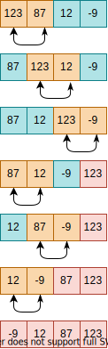

# Bubble sort algorithm

Bubble sort is a simple sorting algorithm that repeatedly swaps two elements if they are in the wrong order.
This process is done until no swaps had to be performed, which means that the list is sorted.

This algorithm is a comparison sort algorithm and receives this name due to the way the larger elements "bubble" in direction of the list's top.

## Complexity

This algorithm has complexity *O(n^2)*.
