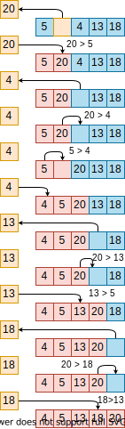

# Insertion sort algorithm

Insertion sort is a simple algorithm.
It starts at the first element of the list (or array), which is already sorted.
Then, it considers the next element, if this element is smaller than the first, they are swapped.
The third element is considered next, which is swapped leftward until it is in its proper order with the first two elements.
This process continues until the entire list is sorted.
In other words, at each iteration, *i*, the sublist containing the *i-1* elements are sorted, and the *i*-th element is compared to that sublist and placed in its proper order.

Example of the insertion sort algorithm:

## Complexity

This algorithm has complexity *O(n^2)* in the average and worst case scenario.
However, in the best case scenario (the array already sorted), it runs in *O(n)* times since are few or no iterations in the inner loop.

## Advantages

The list below comprises some advantages of the insertion sort algorithm:

- it can sort a list as it receives it, that is, the sorting can be done in an *online* manner

- it does not change the order of elements with the same values, that is, it is stable
