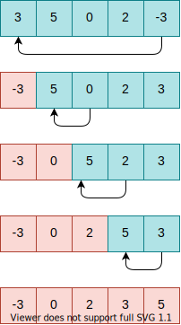
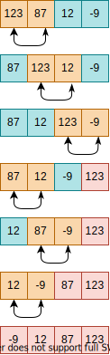
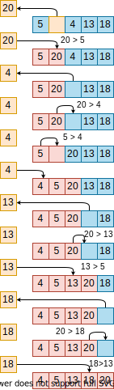
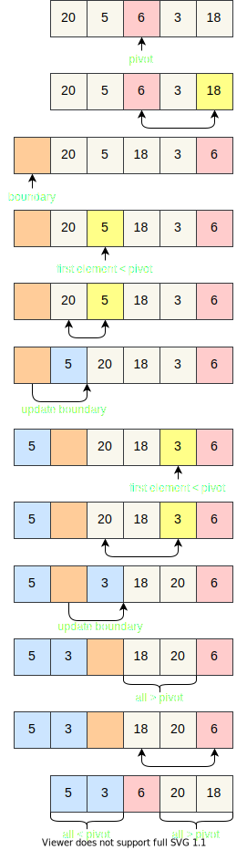
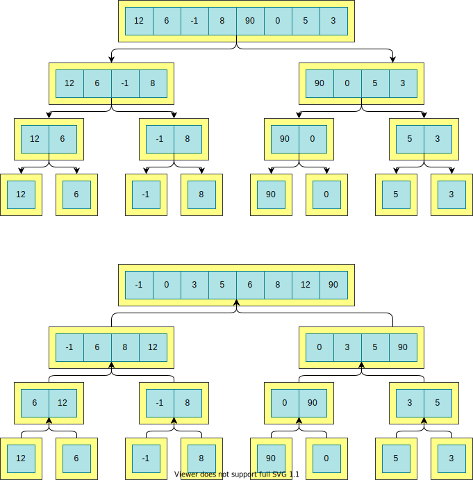

# Sort algorithms

## Selection sort

The selection sort algorithm is a simple sorting algorithm.

This algorithm searches repeatedly for the smaller element in a list of numbers and put that element at de beginning of the list.
Therefore, the algorithm maintain two sublists: one list that is already sorted, and a second list that is unsorted.
In each iteration, the smaller element of the unsorted sublist is found and moved to the sorted sublist.

Example of the selection sort algorithm:

### Complexity:

This algorithm has complexity *O(n^2)*.

## Bubble sort algorithm

Bubble sort is a simple sorting algorithm that repeatedly swaps two elements if they are in the wrong order.
This process is done until no swaps had to be performed, which means that the list is sorted.

This algorithm is a comparison sort algorithm and receives this name due to the way the larger elements "bubble" in direction of the list's top.

### Complexity

This algorithm has complexity *O(n^2)*.

## Insertion sort algorithm

Insertion sort is a simple algorithm.
It starts at the first element of the list (or array), which is already sorted.
Then, it considers the next element, if this element is smaller than the first, they are swapped.
The third element is considered next, which is swapped leftward until it is in its proper order with the first two elements.
This process continues until the entire list is sorted.
In other words, at each iteration, *i*, the sublist containing the *i-1* elements are sorted, and the *i*-th element is compared to that sublist and placed in its proper order.

Example of the insertion sort algorithm:

### Complexity

This algorithm has complexity *O(n^2)* in the average and worst case scenario.
However, in the best case scenario (the array already sorted), it runs in *O(n)* times since are few or no iterations in the inner loop.

### Advantages

The list below comprises some advantages of the insertion sort algorithm:

- it can sort a list as it receives it, that is, the sorting can be done in an *online* manner

- it does not change the order of elements with the same values, that is, it is stable

## Quicksort

Quick sort is a divide-and-conquer algorithm.
The algorithm works by selecting a *pivot* element from the array and partitioning the other elements into two sub-arrays, in the sub-array at left from the pivot are the elements smaller than it, while in the right sub-array contains the elements greater than the pivot.
The final position of the pivot depends on the value of the elements in the array.
However, regardless its final position, where the pivot ends up is its right position in the fully sorted list.
There are different ways to choose the pivot:

- the array's first element
- the array's last element
- a random element
- the median element

The quick sort algorithm can be summarized as:

1. Choose the pivot.
2. Partition the items in the array so that all elements smaller than the pivot are moved to the left of the pivot, the rest elements are moved to its right.
3. Split the array in two sub-arrays, one formed with the elements smaller then the pivot, the other with the elements greater than the pivot. Repeat the process recursively with this two sub-arrays (divide-and-conquer).
4. The process ends each time it encounters a sub-array with fewer than two items.

The process of partitioning the items can be summarized as follows:

1. Swap the pivot with the last item in the array.
2. Determine a boundary (a position) between the items known to be less than the pivot and the rest of the items. At first, this boundary is before the first element.
3. Beginning with the first element after the boundary, search for the first element smaller than the pivot.
Every time that an element smaller than the pivot is found, swap it with the first element after the boundary and increment the boundary.
4. Finish by swapping the pivot with the first element after the boundary.

Example of the quicksort algorithm:

### Complexity

This algorithm has complexity *O(n log n)* in the best and average case scenarios.
In te worst case, it runs in *O(n^2)* times.

## Merge sort

Merge sort is another divide-and-conquer algorithm.
The divide-and-conquer pattern consists of the following steps:

1. **Divide:** If the list size is smaller than a threshold (for example, 2) solve the problem directly using a straightforward method and return the solution obtained in this iteration. Otherwise, divide the input list in two sublists.
2. **Conquer:** For each sublist, solve the subproblems recursively.
3. **Combine:** Take the solutions of each subproblem and merge them into a solution to the original problem.

The merge sort algorithm can be summarized as follows, to sort a sequence *S* with *n* elements using the divide-and-conquer steps:

1. **Divide:** Return *S* if it has zero or one element. If *S* has two or more elements, divide it into two sequences, *S_1* and *S_2*, each sequence having about half of the elements of *S*.
2. **Conquer:** Sort *S_1* and *S_2* recursively.
3. **Combine:** Put back the elements into *S* merging the sorted sequences *S_1* and *S_2* into a sorted sequence.

The figure below illustrates the operation of the merge sort algorithm.

### Complexity

This algorithm has complexity *O(n log n)*.

